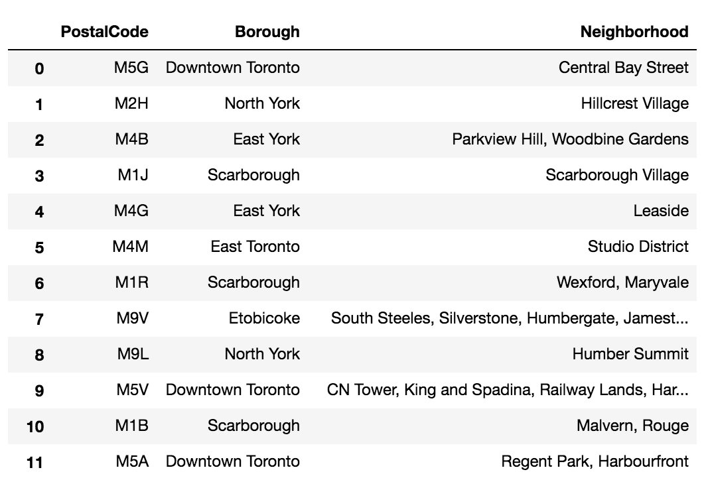

# Exploring-neighborhoods-of-Toronto
Exploring, segmenting, and clustering the neighborhoods in the city of Toronto
In this project I will explore, segment, and cluster the neighborhoods in the city of Toronto. 
However, unlike New York, the neighborhood data is not readily available on the internet. For the Toronto neighborhood data, 
a Wikipedia <a href="https://en.wikipedia.org/wiki/List_of_postal_codes_of_Canada:_M">page </a> exists that has all the information we need to explore and cluster the neighborhoods in Toronto.
 scrape the Wikipedia page and wrangle the data, clean it, and then read it into a pandas dataframe.
 
 
